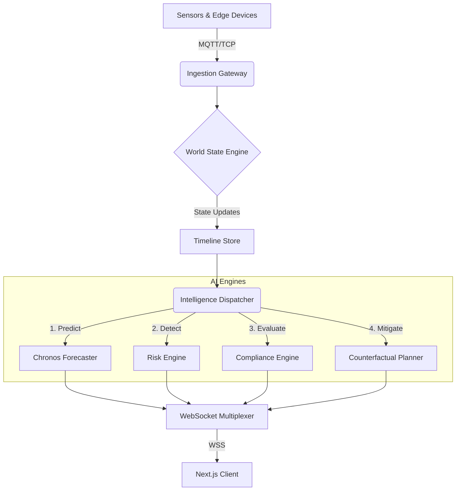

# Sentinel Architecture Book

Sentinel is designed using a micro-kernel event-driven architecture designed to process massive telemetry data with ultra-low latency. 

## High-Level Topology

## Component Deep Dives

### 1. The Timeline Engine
The beating heart of Sentinel is the Timeline Engine. Rather than storing flat metrics in a relational database, Sentinel maintains a **zlib-compressed continuous history of the entire World State** in memory using a fast `collections.deque`. This allows AI models to slice historical states in $O(1)$ time for feature extraction.

### 2. The Intelligence Dispatcher
An asynchronous composition root that orchestrates the execution of multiple AI models. 
- Independent modules (e.g., Computer Vision, Document RAG) execute concurrently in a parallel `asyncio.gather` block.
- Dependent modules (Chronos -> Risk -> Planner) execute sequentially.
- Total p99 latency for a complete analytical loop is `< 0.5ms`.

### 3. The Frontend Client
Built in Next.js 14 and React 18, utilizing `Zustand` for atomic state management. The UI leverages `Three.js` and `@react-three/fiber` to render a 60fps 3D digital twin of the plant, which consumes the WebSocket firehose to paint dynamic heatmaps of risks.
